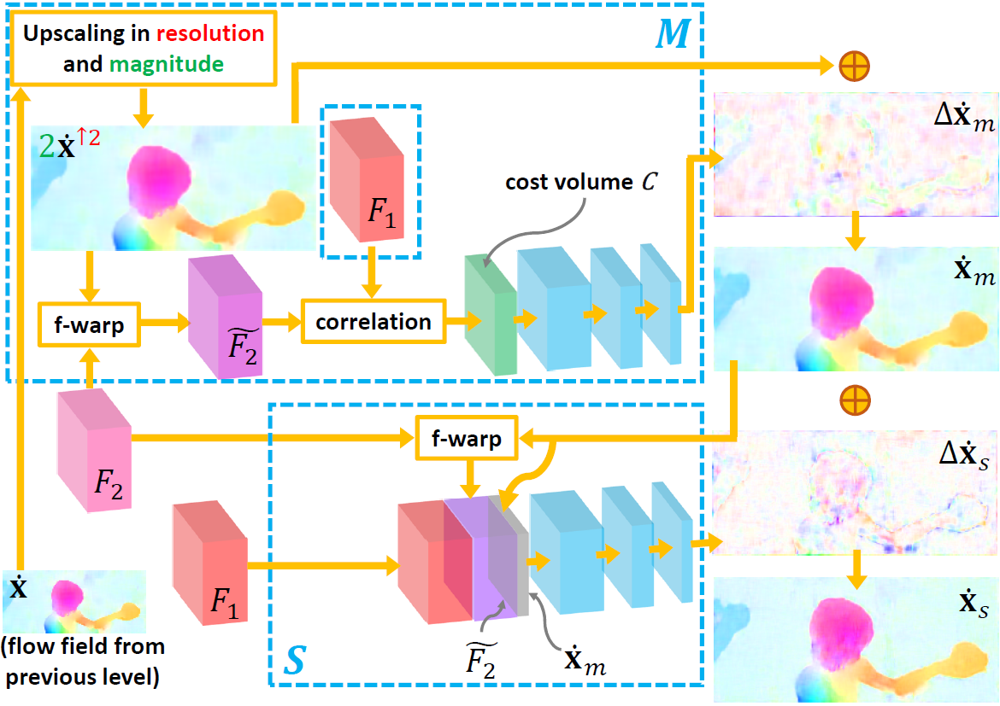

# LiteFlowNet

The network structure of LiteFlowNet. For the ease of representation, only a 3-level design is shown.

A cascaded flow inference module M:S in NetE.

This repository (<strong>https://github.com/twhui/LiteFlowNet</strong>) is the offical release of <strong>LiteFlowNet</strong> for my paper <a href="https://arxiv.org/pdf/1805.07036.pdf"><strong>LiteFlowNet: A Lightweight Convolutional Neural Network for Optical Flow Estimation</strong></a> in CVPR 2018 (Spotlight paper, 6.6%). <i>The up-to-date version of the paper is available on <a href="https://arxiv.org/pdf/1805.07036.pdf"><strong>arXiv</strong></a></i>. 

LiteFlowNet is a lightweight, fast, and accurate opitcal flow CNN. We develop several specialized modules including (1) pyramidal features, (2) cascaded flow inference (cost volume + sub-pixel refinement), (3) feature warping (f-warp) layer, and (4) flow regularization by feature-driven local convolution (f-lconv) layer. LiteFlowNet outperforms PWC-Net (CVPR 2018) on KITTI and has a smaller model size (less than PWC-Net by ~40%). For more details about LiteFlowNet, you may visit <a href="http://mmlab.ie.cuhk.edu.hk/projects/LiteFlowNet/"><strong>my project page</strong></a>.

<a href="https://www.youtube.com/watch?v=pfQ0zFwv-hM">

</a>

Oral presentation at CVPR 2018 is also available on <a href="http://www.youtube.com/watch?v=LBJ20kxr1a0&t=60m33s"> <strong>YouTube</strong></a>.

</ul>
<table>
<thead>
<tr>
<th align="center"></th>
<th align="center">KITTI12 Testing Set (Out-Noc)</th>
<th align="center">KITTI15 Testing Set (Fl-all)</th>
<th align="center">Model Size (M)</th>
</tr>
<tr>
<td align="center">FlowNet2 (CVPR17)</td>
<td align="center">4.82%</td>
<td align="center">10.41%</td>
<td align="center">162.49</td>
<tr>
<td align="center">PWC-Net (CVPR18)</td>
<td align="center">4.22%</td>
<td align="center">9.60%</td>
<td align="center">8.75</td>
</tr>  
<tr>
<td align="center"><strong>LiteFlowNet (CVPR18)</strong></td>
<td align="center"><strong>3.27%</strong></td>
<td align="center"><strong>9.38%</strong></td>
<td align="center"><strong>5.37</strong></td>
</tr>    
</tbody></table>

# LiteFlowNet2
<strong>NEW! Our extended work (LiteFlowNet2, TPAMI 2020) is now available at https://github.com/twhui/LiteFlowNet2</strong>. 

LiteFlowNet2 in TPAMI 2020, another lightweight convolutional network, is evolved from LiteFlowNet (CVPR 2018) to better address the problem of optical flow estimation by improving flow accuracy and computation time. Comparing to our earlier work, LiteFlowNet2 improves the optical flow accuracy on Sintel clean pass by 23.3%, Sintel final pass by 12.8%, KITTI 2012 by 19.6%, and KITTI 2015 by 18.8%. Its runtime is 2.2 times faster!

</ul>
<table>
<thead>
<tr>
<th align="center"></th>
<th align="center">Sintel Clean Testing Set</th>
<th align="center">Sintel Final Testing Set</th>
<th align="center">KITTI12 Testing Set (Out-Noc)</th>
<th align="center">KITTI15 Testing Set (Fl-all)</th>
<th align="center">Model Size (M)</th> 
<th align="center">Runtime* (ms) GTX 1080</th> 
</tr>
<tr>
<td align="center">FlowNet2 (CVPR17)</td>
<td align="center">4.16</td>
<td align="center">5.74</td>
<td align="center">4.82%</td>
<td align="center">10.41%</td>
<td align="center">162</td>
<td align="center">121</td>
</tr> 
<tr>
<td align="center">PWC-Net+</td>
<td align="center"><strong>3.45</strong></td>
<td align="center"><strong>4.60</strong></td>
<td align="center">3.36%</td>
<td align="center">7.72%
<td align="center">8.75</td> 
<td align="center"><strong>40</strong></td>
</tr> 
<tr>
<td align="center"><strong>LiteFlowNet2</strong></td>
<td align="center"><strong>3.48</strong></td>
<td align="center"><strong>4.69</strong></td>
<td align="center"><strong>2.63%</strong></td>
<td align="center"><strong>7.62%</strong></td>
<td align="center"><strong>6.42</strong></td>
<td align="center"><strong>40</strong></td>
</tr>    
</tbody></table>

Note: *Runtime is averaged over 100 runs for a Sintel's image pair of size 1024 × 436. 

# LiteFlowNet3
<strong>NEW! Our extended work (LiteFlowNet3, ECCV 2020) is now available at https://github.com/twhui/LiteFlowNet3</strong>. 

We ameliorate the issue of outliers in the cost volume by amending each cost vector through an adaptive modulation prior to the flow decoding. We further improve the flow accuracy by exploring local flow consistency. To this end, each inaccurate optical flow is replaced with an accurate one from a nearby position through a novel warping
of the flow field. LiteFlowNet3 not only achieves promising results on public benchmarks but also has a small model size and a fast runtime.

</ul>
<table>
<thead>
<tr>
<th align="center"></th>
<th align="center">Sintel Clean Testing Set</th>
<th align="center">Sintel Final Testing Set</th>
<th align="center">KITTI12 Testing Set (Avg-All)</th>
<th align="center">KITTI15 Testing Set (Fl-fg)</th>
<th align="center">Model Size (M)</th> 
<th align="center">Runtime* (ms) GTX 1080</th> 
</tr>
<tr>
<td align="center">LiteFlowNet (CVPR18)</td>
<td align="center">4.54</td>
<td align="center">5.38</td>
<td align="center">1.6</td>
<td align="center">7.99%</td>
<td align="center">5.4</td>
<td align="center">88</td>
</tr> 
<tr>
<td align="center">LiteFlowNet2 (TPAMI20)</td>
<td align="center">3.48</td>
<td align="center">4.69</td>
<td align="center">1.4</td>
<td align="center">7.64%</td>
<td align="center">6.4</td>
<td align="center"><strong>40</strong></td>
</tr> 
<tr>
<td align="center">HD3 (CVPR19)</td>
<td align="center">4.79</td>
<td align="center">4.67</td>
<td align="center">1.4</td>
<td align="center">9.02%</td>
<td align="center">39.9</td>
<td align="center">128</td>
</tr> 
<tr>
<td align="center">IRR-PWC (CVPR19)</td>
<td align="center">3.84</td>
<td align="center">4.58</td>
<td align="center">1.6</td>
<td align="center">7.52%</td>
<td align="center">6.4</td>
<td align="center">180</td>
</tr>
<tr>
<td align="center"><strong>LiteFlowNet3 (ECCV20)</strong></td>
<td align="center"><strong>3.03</strong></td>
<td align="center"><strong>4.53</strong></td>
<td align="center"><strong>1.3</strong></td>
<td align="center"><strong>6.96%</strong></td>
<td align="center"><strong>5.2</strong></td>
<td align="center">59</td>
</tr>    
</tbody></table>

Note: *Runtime is averaged over 100 runs for a Sintel's image pair of size 1024 × 436. 

# License and Citation
This software and associated documentation files (the "Software"), and the research paper (<i>LiteFlowNet: A Lightweight Convolutional Neural Network for Optical Flow Estimation</i>) including but not limited to the figures, and tables (the "Paper") are provided for academic research purposes only and without any warranty. Any commercial use requires my consent. When using any parts of the Software or the Paper in your work, please cite the following paper:

<pre><code>@InProceedings{hui18liteflownet,    
 author = {Tak-Wai Hui and Xiaoou Tang and Chen Change Loy},    
 title = {{LiteFlowNet: A Lightweight Convolutional Neural Network for Optical Flow Estimation}},    
 booktitle = {{Proceedings of IEEE Conference on Computer Vision and Pattern Recognition (CVPR)}},    
 year = {2018},  
 pages = {8981--8989},
 url = {http://mmlab.ie.cuhk.edu.hk/projects/LiteFlowNet/} 
}</code></pre>

# Datasets
1. <a href="https://lmb.informatik.uni-freiburg.de/data/FlyingChairs/FlyingChairs.zip"> FlyingChairs dataset</a> (31GB) and <a href="https://lmb.informatik.uni-freiburg.de/resources/datasets/FlyingChairs/FlyingChairs_train_val.txt">train-validation split</a>.
2. <a href="https://lmb.informatik.uni-freiburg.de/data/SceneFlowDatasets_CVPR16/Release_april16/data/FlyingThings3D/raw_data/flyingthings3d__frames_cleanpass.tar"> RGB image pairs (clean pass)</a> (37GB) and <a href="https://lmb.informatik.uni-freiburg.de/data/SceneFlowDatasets_CVPR16/Release_april16/data/FlyingThings3D/derived_data/flyingthings3d__optical_flow.tar.bz2"> flow fields</a> (311GB) for Things3D dataset.
3. <a href="http://files.is.tue.mpg.de/sintel/MPI-Sintel-complete.zip"> Sintel dataset (clean + final passes)</a> (5.3GB).
4. <a href="http://www.cvlibs.net/download.php?file=data_stereo_flow.zip"> KITTI12 dataset</a> (2GB) and <a href="http://www.cvlibs.net/download.php?file=data_scene_flow.zip"> KITTI15 dataset</a> (2GB) (Simple registration is required).

</ul>
<table>
<thead>
<tr>
<th align="center"></th>
<th align="center">FlyingChairs</th>
<th align="center">FlyingThings3D</th>
<th align="center">Sintel</th>
<th align="center">KITTI</th>
</tr>
<tr>
<td align="center">Crop size</td>
<td align="center">448 x 320</td>
<td align="center">768 x 384</td>
<td align="center">768 x 384</td>
<td align="center">896 x 320</td>
</tr>  
<tr>
<td align="center">Batch size</td>
<td align="center">8</td>
<td align="center">4</td>
<td align="center">4</td>
<td align="center">4</td>
</tr>    
</tbody></table>

# Prerequisite
The code package comes as the modified Caffe from <a href="https://lmb.informatik.uni-freiburg.de/resources/software.php">DispFlowNet</a> and <a href="https://github.com/lmb-freiburg/flownet2">FlowNet2</a> with our new layers, scripts, and trained models. 

Reimplementations in <a href="https://github.com/twhui/LiteFlowNet#Reimplementations-in-PyTorch-and-TensorFlow">Pytorch and TensorFlow</a> are also available.

Installation was tested under Ubuntu 14.04.5/16.04.2 with CUDA 8.0, cuDNN 5.1 and openCV 2.4.8/3.1.0. 

Edit Makefile.config (and Makefile) if necessary in order to fit your machine's settings.

For openCV 3+, you may need to change <code>opencv2/gpu/gpu.hpp</code> to <code>opencv2/cudaarithm.hpp</code> in <code>/src/caffe/layers/resample_layer.cu</code>.

If your machine installed a newer version of cuDNN, you do not need to downgrade it. You can do the following trick: 
1. Download <code>cudnn-8.0-linux-x64-v5.1.tgz</code> and untar it to a temp folder, say <code>cuda-8-cudnn-5.1</code>	

2. Rename <code>cudnn.h</code> to <code>cudnn-5.1.h</code> in the folder <code>/cuda-8-cudnn-5.1/include</code>	

3. <pre><code>$ sudo cp cuda-8-cudnn-5.1/include/cudnn-5.1.h /usr/local/cuda/include/</code>	
   <code>$ sudo cp cuda-8-cudnn-5.1/lib64/lib* /usr/local/cuda/lib64/</code></pre>	

4. Replace <code>#include <cudnn.h></code> to <code>#include <cudnn-5.1.h></code> in <code>/include/caffe/util/cudnn.hpp</code>.
    
# Compiling
<pre><code>$ cd LiteFlowNet</code>
<code>$ make -j 8 tools pycaffe</code></pre>

# Feature warping (f-warp) layer
The source files include <code>/src/caffe/layers/warp_layer.cpp</code>, <code>/src/caffe/layers/warp_layer.cu</code>, and <code>/include/caffe/layers/warp_layer.hpp</code>. 

The grid pattern that is used by f-warp layer is generated by a grid layer. The source files include <code>/src/caffe/layers/grid_layer.cpp</code> and <code>/include/caffe/layers/grid_layer.hpp</code>.

# Feature-driven local convolution (f-lconv) layer
It is implemented using off-the-shelf components. More details can be found in <code>/models/testing/depoly.prototxt</code> or <code>/models/training_template/train.prototxt.template</code> by locating the code segment <code>NetE-R</code>.

# Other layers
Two custom layers (<code>ExpMax</code> and <code>NegSquare</code>) are optimized in speed for forward-pass. Generalized Charbonnier loss is implemented in l1loss_layer. The power factor (<code>alpha</code>) can be adjusted in <code>l1_loss_param { power: alpha l2_per_location: true }</code>.

# Training
1. Prepare the training set. In <code>/data/make-lmdbs-train.sh</code>, change <code>YOUR_TRAINING_SET</code> and <code>YOUR_TESTING_SET</code> to your favourite dataset.
<pre><code>$ cd LiteFlowNet/data</code>
<code>$ ./make-lmdbs-train.sh</code></pre>

2. Copy files from <code>/models/training_template</code> to a new model folder (e.g. <code>NEW</code>). Edit all the files and make sure the settings are correct for your application. Model for the complete network is provided. LiteFlowNet uses stage-wise training to boost the performance. Please refer to <a href="https://arxiv.org/pdf/1805.07036.pdf"><strong>my paper</strong></str></a></i> for more details.
<pre><code>$ mkdir LiteFlowNet/models/NEW</code>
<code>$ cd LiteFlowNet/models/NEW</code>
<code>$ cp ../training_template/solver.prototxt.template solver.prototxt</code>	
<code>$ cp ../training_template/train.prototxt.template train.prototxt</code>
<code>$ cp ../training_template/train.py.template train.py</code></pre>		

3. Create a soft link in your new model folder
<pre><code>$ ln -s ../../build/tools bin</code></pre>

4. Run the training script	
<pre><code>$ ./train.py -gpu 0 2>&1 | tee ./log.txt</code></pre>

# Trained models	
The trained models (<code>liteflownet</code>, <code>liteflownet-ft-sintel</code>, <code>liteflownet-ft-kitti</code>) are available in the folder <code>/models/trained</code>. Untar the files to the same folder before you use it.

<code>liteflownet</code>: Trained on Chairs and then fine-tuned on Things3D.

<code>liteflownet-ft-sintel</code>: Model used for Sintel benchmark.

<code>liteflownet-ft-kitti</code>: Model used for KITTI benchmark.

# Testing 
1. Open the testing folder
<pre><code>$ cd LiteFlowNet/models/testing</pre></code>

2. Create a soft link in the folder <code>/testing</code>
<pre><code>$ ln -s ../../build/tools bin</code></pre>

3. Replace <code>MODE</code> in <code>./test_MODE.py</code> to <code>batch</code> if all the images has the same resolution (e.g. Sintel dataset), otherwise replace it to <code>iter</code> (e.g. KITTI dataset).

4. Replace <code>MODEL</code> in lines 9 and 10 of <code>test_MODE.py</code> to one of the trained models (e.g. <code>liteflownet-ft-sintel</code>).

5. Run the testing script. Flow fields (<code>MODEL</code>-0000000.flo, <code>MODEL</code>-0000001.flo, ... etc) are stored in the folder <code>/testing/results</code> having the same order as the image pair sequence. 
<pre><code>$ test_MODE.py img1_pathList.txt img2_pathList.txt results</code></pre>

# Evaluation
Average end-point error can be computed using the provided script <code>/models/testing/util/endPointErr.m</code>

# Reimplementations in PyTorch and TensorFlow
1. A PyTorch-based reimplementation of LiteFlowNet is available at https://github.com/sniklaus/pytorch-liteflownet. 
2. A TensorFlow-based reimplementation of LiteFlowNet is also available at https://github.com/keeper121/liteflownet-tf2.

# Declaration
The early version of LiteFlowNet was submitted to <a href="https://iccv2017.thecvf.com/"> ICCV 2017</a> for review in March 2017. The improved work was published in <a href="https://cvpr2018.thecvf.com/">CVPR 2018</a>. 
